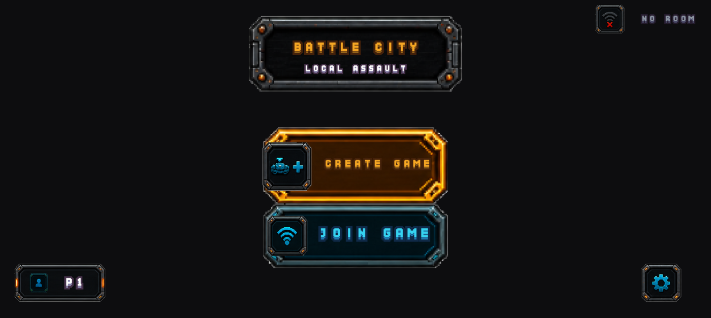
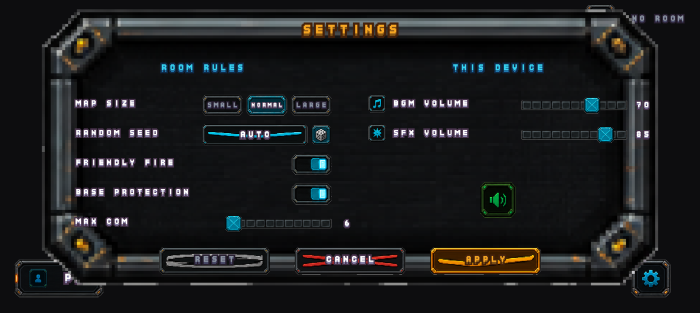
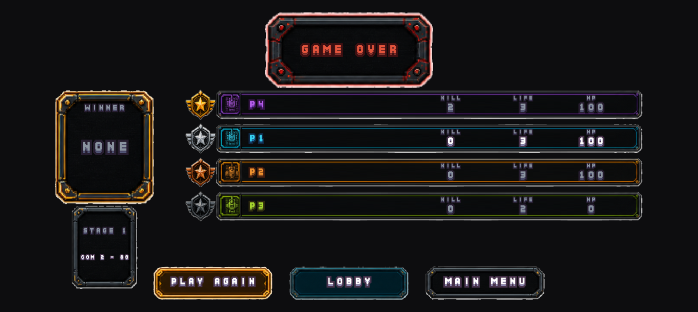
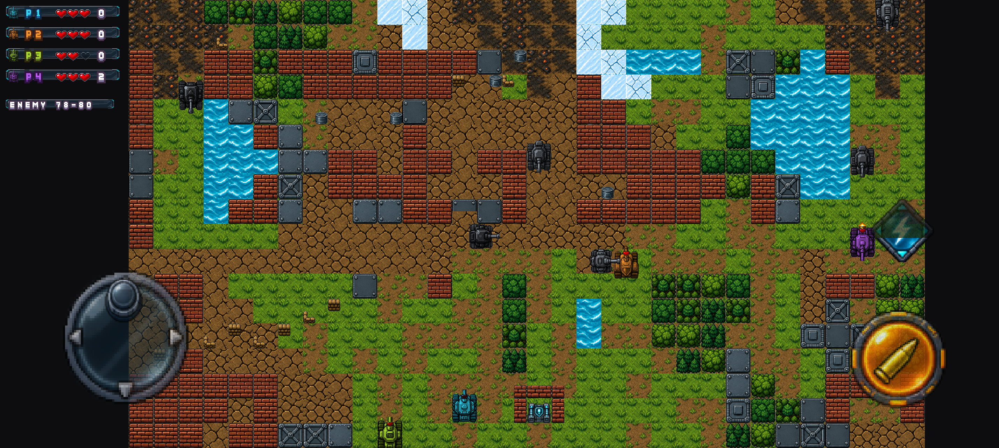
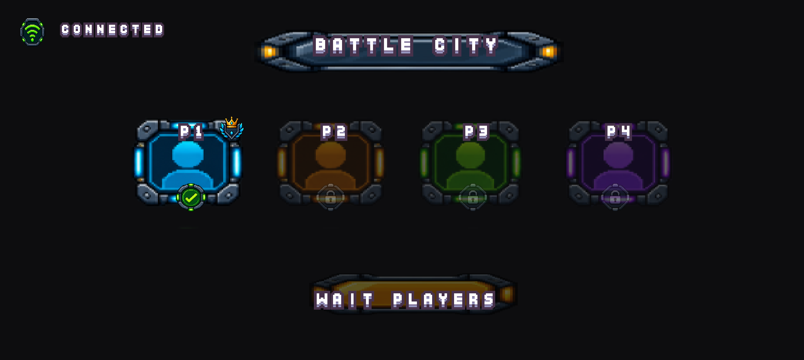
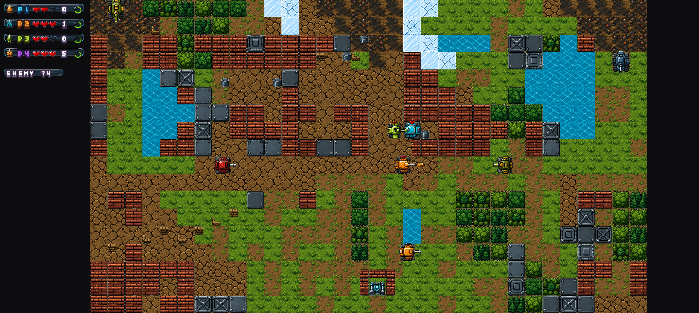

# Battle City: Local Assault

원작 Battle City의 핵심 게임 플레이를 유지하면서, **최대 4인 로컬 네트워크 멀티플레이**와 **탱크 타입/특수기 시스템**을 추가한 Android 리메이크 프로젝트입니다.

> 상세 설계는 [battle_city_android_development_plan.md](./battle_city_android_development_plan.md) 참고

---

## 주요 특징

- 최대 4인 로컬 Wi-Fi 멀티플레이 (Host Authoritative)
- 3종 플레이어 탱크 (공격형 / 방어형 / 스피드형)
- 탱크별 고유 특수기 (관통탄 / 방어막 / 대시)
- 공격력 / 방어력 / 이동속도 / 연사속도 차별화
- 플레이어별 생명 3개 (HP와 Life 분리)
- COM 탱크 타입 다양화 + 상태 머신 AI
- 모바일 터치 UI (가상 조이스틱 + Fire / Special)
- Vulkan 기반 2D 렌더링, OpenGL ES fallback
- 휴대폰 / 태블릿 / 폴더블 대응

---

## 게임 루프

```text
게임 생성 → 로컬 네트워크 방 생성 → 2~4명 참가 → 탱크 선택
    → 스테이지 시작 → COM 출현 → 전투
    → COM (20 × 플레이어 수) 전멸 → Kill Count 비교 → 최다 처치 플레이어 승리
```

---

## 원작 유지 범위

격자 기반 맵, 벽돌·강철·물·숲·얼음 타일, 본진, 4방향 이동, 포탄, 적 탱크 출현,
본진 방어, 맵 파괴, 탱크 충돌, 폭발 효과, 스테이지 클리어 구조를 유지합니다.

원작의 1인 플레이 구조만 2~4인 로컬 멀티플레이 구조로 변경합니다.

---

## 플레이어 탱크

| 능력 | 공격형 | 방어형 | 스피드형 |
|---|---:|---:|---:|
| 공격력 | 3 | 2 | 1 |
| 방어력 | 1 | 3 | 1 |
| 이동속도 | 2 | 1 | 4 |
| 연사속도 | 2 | 2 | 3 |
| 특수기 | 관통탄 | 방어막 | 대시 |
| 특수기 쿨타임 | 8초 | 10초 | 6초 |

### 특수기

- **관통탄** (공격형): 강철 블록에 높은 데미지, COM 탱크 관통
- **방어막** (방어형): 3초간 받는 피해 50% 감소
- **대시** (스피드형): 1초간 이동속도 2배, 충돌 회피용

능력치는 하드코딩하지 않고 `TankConfig` 데이터로 관리합니다.

---

## COM 탱크

COM도 공격형 / 방어형 / 스피드형 3종으로 구성되며, 타입별 AI 성향이 다릅니다.

```text
Total Enemy Count = Player Count × 20
```

| 플레이어 | 총 COM |
|---:|---:|
| 2명 | 40 |
| 3명 | 60 |
| 4명 | 80 |

**총 COM 수와 동시 존재 COM 수를 분리합니다.** (동시 존재 최대 8~12)
COM이 파괴되면 다음 COM을 생성해 저사양 기기에서 성능을 유지합니다.

### AI 상태 머신

```text
Spawn → Patrol → Chase → Attack → DefendBase → Avoid → Dead
```

본진이 위험하면 본진 방어를 우선하고, 그 외에는 가장 가까운 플레이어를 추적·공격합니다.

---

## 게임 규칙

### 데미지

```text
Damage = max(1, AttackerAttackPower - DefenderDefensePower × DefenseCoefficient)
```

### 생명

```text
HP 0 → Tank Destroyed → Life - 1 → Respawn
```

Life 3개를 모두 잃으면 해당 플레이어는 탈락합니다.

### VICTORY

모든 COM 전멸 시 플레이어별 Kill Count를 비교해 최다 처치 플레이어가 승리합니다.
동점 시 우선순위: Kill Count → 남은 Life → 남은 HP → 공동 승리

### GAME OVER

```text
본진 파괴 (아군/적군 구분 없음)
        OR
모든 플레이어 Life 소진
```

---

## 네트워크

인터넷 서버 없이 동일 Wi-Fi 네트워크 기반으로 동작합니다.
게임 생성자가 Host(권위 서버) 역할을 담당합니다.

| 방향 | 전송 데이터 |
|---|---|
| Client → Host | playerId, direction, fire, special |
| Host → Client | player / enemy / projectile / base state, score, game phase |

Host가 COM 생성·AI, 충돌 판정, 데미지, 사망, 점수, 본진 파괴, 게임 종료, 승자를 결정합니다.

### Tick

```text
Game Logic      60 Hz
Network State   20~30 Hz
Rendering       Device FPS
```

### 연결 끊김

- **Client 종료**: 해당 플레이어를 DEAD / DISCONNECTED 처리, 나머지 플레이어는 계속 진행
- **Host 종료**: 초기 버전은 Host Migration 미구현 → 게임 종료 후 로비 복귀

---

## 렌더링

```text
Vulkan 지원? ── YES ──→ Vulkan
      │
      NO ──→ OpenGL ES fallback
```

- 2D Sprite / Tile Map / Particle / Explosion / Shader / UI Rendering
- Sprite Batch, Object Pool(Bullet / Explosion / Enemy), Fixed Timestep(60 Hz)
- 논리 해상도(예: 256 × 224)를 유지하고 Viewport만 조정해 다양한 화면 비율·폴더블에 대응

---

## 아키텍처

```text
app/
├── core/        GameLoop, GameState, Time, Constants
├── gameplay/    Player, Enemy, Tank, Projectile, Base, Explosion
├── map/         Tile, TileMap, MapLoader, CollisionMap
├── ai/          EnemyAI, BehaviorState
├── network/     Host, Client, NetworkMessage, NetworkGameState
├── rendering/   VulkanRenderer, SpriteRenderer, TileRenderer, ParticleRenderer
├── input/       TouchInput, VirtualJoystick
└── ui/          LobbyScreen, GameHUD, TankSelectScreen, ResultScreen, GameOverScreen
```

### 게임 상태 머신

```text
  MENU ──CREATE/JOIN──▶ LOBBY ──START──▶ BATTLE ──승패──▶ RESULT
    ▲                     ▲   ◀──LOBBY───────────────────┘ │
    │                     └───PLAY AGAIN────────────────────┘ │
    └──────────────────────MAIN MENU──────────────────────────┘
```

`GameHost.screen` 하나가 지금 무엇을 그리고 손가락을 어디로 보낼지 정합니다.
설정 화면만 예외로, 다른 화면 **위에** 덮입니다.
자세한 것은 [docs/SCREENS.md](./docs/SCREENS.md) 에 있습니다.

---

## 조작

- **좌측**: 가상 조이스틱 (아날로그 터치 입력 → 가장 가까운 4방향으로 변환)
- **우측**: FIRE 버튼, SPECIAL 버튼

---

## 성능 목표

| 항목 | 목표 |
|---|---:|
| 목표 FPS | 60 FPS |
| 최소 목표 FPS | 30 FPS |
| Network | 20~30 Hz |
| 동시 COM | 8~12 |
| 총 COM | 최대 80 |
| Texture | 최소화 |
| Draw Call | 최소화 |

---

## 빌드 / 실행

```bash
./gradlew :app:assembleDebug        # APK 빌드 (Vulkan + GLES 네이티브 포함)
./gradlew :app:testDebugUnitTest    # 단위 테스트
adb install -r app/build/outputs/apk/debug/app-debug.apk
```

| 항목 | 값 |
|---|---|
| minSdk / targetSdk / compileSdk | 26 / 35 / 35 |
| NDK / CMake | 27.0.12077973 / 3.22.1 |
| ABI | arm64-v8a, armeabi-v7a, x86_64 |
| 화면 방향 | **가로(landscape) 고정** — 세로는 허용하지 않는다 |
| 논리 해상도 | **4:3** — 2인 1024×768 / 3인 1280×960 / 4인 1536×1152 |

OpenGL ES 폴백 경로를 강제로 확인하려면:

```bash
adb shell am start -n com.kophas.battlecity/.MainActivity --ez preferVulkan false
```

---

## 프로젝트 구조

```text
app/src/main/
├── cpp/                      네이티브 렌더러
│   ├── renderer.h            IRenderer 추상 인터페이스
│   ├── jni_bridge.cpp        Kotlin <-> 네이티브 경계 (direct ByteBuffer)
│   ├── vk/vk_renderer.cpp    Vulkan 2D 스프라이트 렌더러
│   ├── gl/gl_renderer.cpp    OpenGL ES 3.0 폴백
│   └── shaders/              GLSL -> SPIR-V -> C 헤더 (빌드 시 glslc)
│
├── kotlin/com/kophas/battlecity/
│   ├── core/                 Constants, Direction, FixedStepClock, GameLoop
│   ├── map/                  TileType, TileMap, StageGenerator, StageData,
│   │                         StageTheme, MapGenProfile, Rng
│   ├── gameplay/             GameWorld, MatchState, BalanceConfig, Tank,
│   │                         Projectile, Explosion, ObjectPool
│   ├── render/               Viewport, SpriteBatch, TextureAtlas, GridAtlas,
│   │                         AssetManifest, GameAssets, SpriteCatalog,
│   │                         WorldRenderer, HudRenderer, NativeRenderer
│   ├── game/                 GameHost, BattleScene, LobbyScene, NetDriver
│   ├── util/                 Json (의존성 없는 파서)
│   ├── MainActivity.kt
│   └── GameSurfaceView.kt
│
└── assets/
    ├── atlas/                game.png + game.xml (스프라이트 195장, 한 장)
    └── manifest/
        ├── assets.json       게임 의미 <-> 리소스 매핑
        ├── balance.json      게임 규칙과 능력치
        ├── mapgen.json       랜덤 맵 생성 규칙
        └── audio.json        사건 <-> 소리 · 진동 · 저사양 설정
```

---

## 리소스

인게임 그래픽은 자체 제작 에셋 팩(`assets/`)이고, HUD 폰트만 Kenney CC0 입니다. 적용 방식과 전체 매핑표는
[docs/ASSET_SELECTION.md](./docs/ASSET_SELECTION.md),
스테이지 랜덤 생성 설계는 [docs/STAGE_GENERATION.md](./docs/STAGE_GENERATION.md),
COM AI 설계는 [docs/AI.md](./docs/AI.md),
로컬 멀티플레이 설계는 [docs/NETWORK.md](./docs/NETWORK.md),
사운드·진동·저사양 대응은 [docs/AUDIO.md](./docs/AUDIO.md),
화면 전환·방 설정·결과 화면은 [docs/SCREENS.md](./docs/SCREENS.md) 를 참고하세요.

크레딧은 [CREDITS.md](./CREDITS.md) 에 있습니다.

---

## 개발 단계

| Phase | 내용 | 상태 |
|---|---|---|
| Phase 1 | 프로젝트 기반 — Android/Kotlin, Vulkan 초기화, 게임 루프, 고정 timestep, Sprite 렌더링 | ✅ 완료 |
| Phase 2 | 원작 핵심 게임 — Tile Map, 타일 종류, 본진, 탱크 이동, 포탄, 충돌, 폭발 | ✅ 완료 |
| Phase 3 | 플레이어 시스템 — 3종 탱크, 능력치, HP, Life, 사망, 점수 | ✅ 완료 |
| Phase 3.5 | 아트 리워크 — 픽셀아트 월드 통일, 지형·환경 대폭 보강, 비트맵 폰트 HUD | ✅ 완료 |
| Phase 4 | 특수기 — 관통탄, 방어막, 대시, 쿨타임, UI | ✅ 완료 |
| Phase 4.5 | 환경 아트 교체 — 지형·구조물·환경 오브젝트를 자체 리소스로 전면 교체 | ✅ 완료 |
| Phase 5 | COM — Spawn, 타입별 AI, State Machine, 20 × Player 수 생성 | ✅ 완료 |
| Phase 5.5 | 에셋 리팩터링 — 자체 에셋 팩 전면 적용, 아틀라스 1장, 16:9, 룰 기반 맵 생성 | ✅ 완료 |
| Phase 6 | 로컬 멀티플레이 — Host, Join, Lobby, 상태 동기화, Disconnect 처리 | ✅ 완료 |
| Phase 7 | 모바일 UI — Virtual Joystick, Fire/Special, HUD, 로비 화면 | ✅ 완료 |
| Phase 8 | 최종화 — 사운드, 이펙트, 진동, 최적화, 저사양/Tablet/Fold/해상도 테스트 | ✅ 완료 |
| Phase 9 | 화면 완성 — 메인 메뉴, 방 설정(본진 보호·아군 오사·맵 크기·소리), 결과 화면, 카운트다운 소리, 네트워크 지연 표시 | ✅ 완료 |

### MVP 순서

1. **MVP 1** — 1 Player + 원작 맵 + 탱크 + 포탄 + COM + 본진
2. **MVP 2** — 3 Tank Types + HP/Life + Special Skill
3. **MVP 3** — 2 Player + LAN
4. **MVP 4** — 4 Player + 80 COM + Complete Game Rules
5. **MVP 5** — Optimization + Tablet + Fold + Low-end Android

---

## 개발 원칙

1. 게임 로직과 렌더링을 분리한다.
2. 네트워크 게임에서는 Host authoritative architecture를 사용한다.
3. Client는 게임 결과를 결정하지 않는다.
4. 모든 게임 규칙은 deterministic하게 작성한다.
5. Tank, Enemy, Projectile, Tile은 독립적인 데이터 모델을 가진다.
6. Tank 능력치는 하드코딩하지 않고 Config/Data 구조로 관리한다.
7. 게임 월드는 논리 해상도를 사용하고 실제 화면 해상도와 분리한다.
8. 4방향 이동은 논리적인 방향값으로 관리한다.
9. 모든 시간 관련 기능은 game tick 기반으로 관리한다.
10. Bullet, Enemy, Explosion은 Object Pool을 사용한다.
11. Vulkan Renderer와 Game Logic을 강하게 결합하지 않는다.
12. Android UI와 게임 렌더링 영역을 분리한다.
13. 기능 구현 후 반드시 Unit Test 또는 Debug Test를 추가한다.
14. 한 번에 대규모 코드를 생성하지 않고 Phase 단위로 구현한다.
15. 기존 구현을 수정할 때 기존 기능을 임의로 삭제하지 않는다.
16. 네트워크 입력과 게임 상태를 분리한다.
17. Host만 충돌, 데미지, 사망, 점수, 승패를 최종 결정한다.
18. 모든 네트워크 메시지는 버전 확장을 고려한 구조로 설계한다.
19. 게임 규칙과 밸런스 값은 설정 데이터로 분리한다.
20. 각 Phase가 완료될 때 빌드 및 테스트 가능한 상태를 유지한다.

---

## 사운드

원작 음원은 권리 문제가 있을 수 있으므로 오리지널 사운드 에셋을 제작합니다.

Tank Move / Tank Fire / Special / Bullet Hit / Brick Destroy / Steel Hit /
Tank Explosion / Player Death / Enemy Spawn / Base Warning / Base Destroy / Victory / Game Over

---

## 라이선스

미정

---

## 실행 화면

seed 로 생성된 4인용 4:3 스테이지(24×18 블록). 지형·도로 오토타일, 흙 구역,
벽돌·석재 구조물, 환경 오브젝트, 본진이 모두 랜덤 배치됩니다.
월드는 16px 픽셀아트, 회전하는 탱크만 벡터풍 팩을 씁니다.



메인 메뉴에서 방을 만들거나 남의 방에 들어갑니다. 오른쪽 위는 같은 망에 열린 방이
있는지 살핀 결과입니다 — 없는데 JOIN 을 눌러 빈 화면을 보고 있는 일을 줄입니다.



한 화면에 두 종류가 있습니다. 왼쪽 **방 규칙**(맵 크기 · 시드 · 아군 오사 · 본진 보호 ·
동시 COM 수)은 방장만 정하고 판을 열 때 모두에게 걸립니다. 오른쪽 **소리 크기**는
이 기기에만 걸리고 손을 떼는 즉시 반영되며 다음에도 남습니다.



처치 수 → 남은 Life → 남은 HP 순으로 순위를 가릅니다. PLAY AGAIN 은 방장만 누를 수
있고, 다른 사람이 모두 결과 화면을 떠나면 방장이라도 누를 수 없습니다.



왼쪽은 짚은 자리에 생기는 가상 조이스틱, 오른쪽 아래는 FIRE 와 SPECIAL 입니다.
아날로그로 받아 가장 가까운 네 방향으로 접습니다. 특수기 쿨타임은 **버튼 자체**가
아래에서 차오르며 보여 주고, 다 차면 살짝 맥동합니다.
HUD 에는 로비에서 고른 이름과 탱크가 고른 색으로 함께 나옵니다.



로비에서 이름(세 글자) · 탱크 종류 · 색을 고릅니다. 사람끼리 같은 색은 고를 수 없고
COM 색도 고를 수 없습니다. Host 만 START 를 누를 수 있고 최소 두 명이 모두 준비해야 합니다.



인게임 그래픽 전체를 자체 에셋 팩으로 교체했습니다. 탱크는 4방향이 미리 그려져 있어
회전 없이 그리고, 아틀라스는 한 장이라 프레임 안에서 텍스처 교체가 없습니다.
화면비는 16:9 고정이며, 맵은 `assets/RANDOM_MAP_ASSET_GUIDE.md` 를 구현한 룰 기반
생성기가 만듭니다 — 경로를 먼저 깔고 지형을 군집으로 놓은 뒤 연결성·공정성을 검증해
85점 미만이면 폐기합니다. HUD 는 상태창 판 위에 탱크 초상 · 하트 · 처치 수 ·
특수기 쿨타임 고리를 얹습니다. 설계는 [docs/AI.md](./docs/AI.md) 와
[docs/STAGE_GENERATION.md](./docs/STAGE_GENERATION.md) 에 있습니다.
