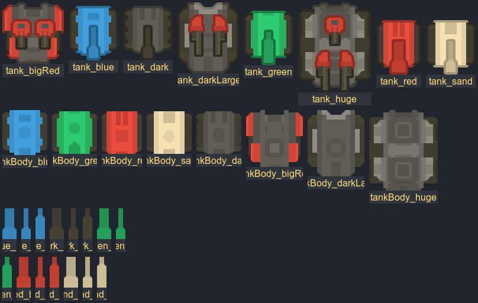
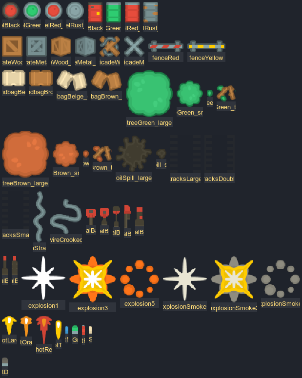
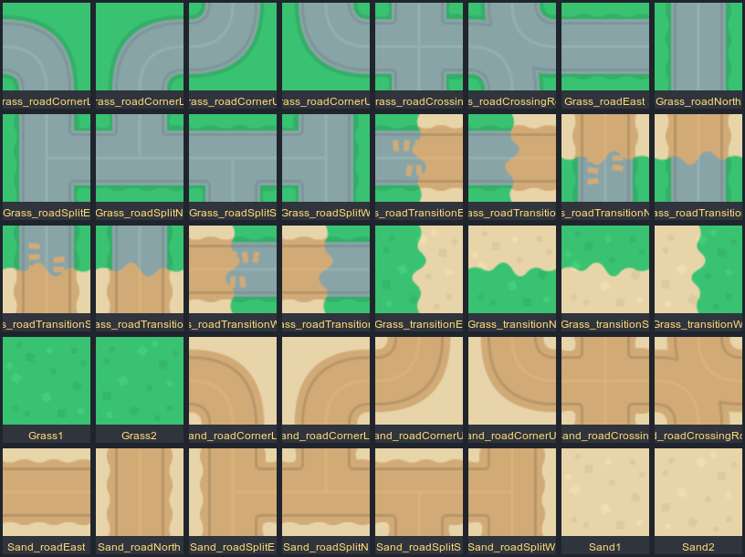
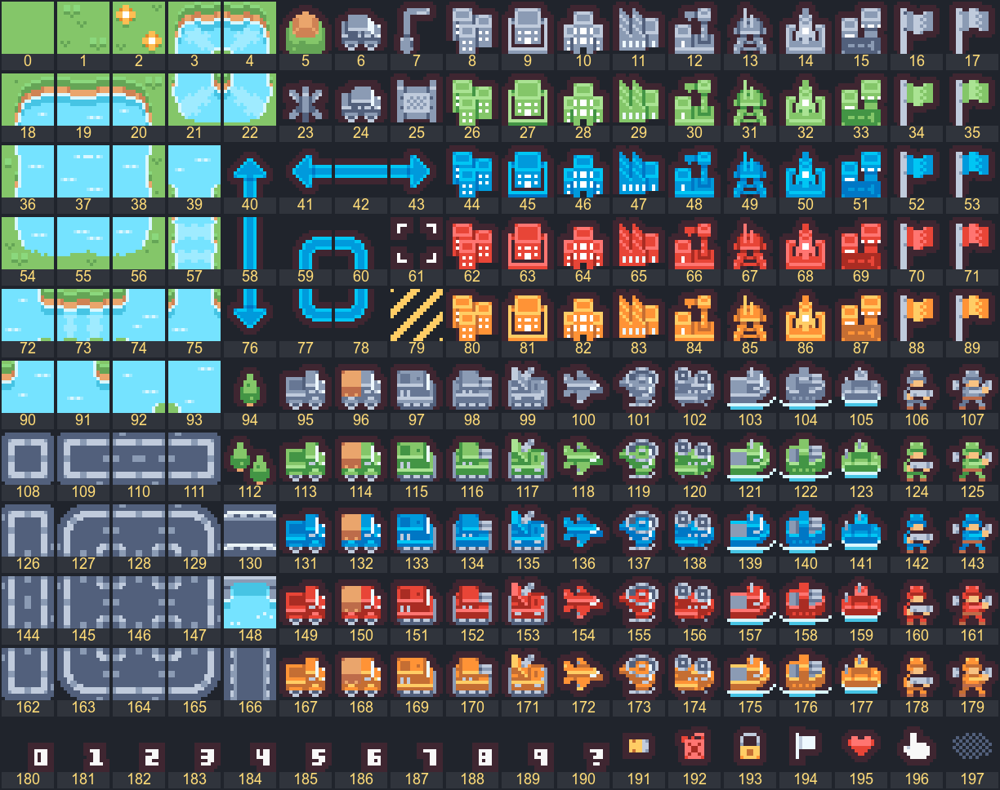

# 리소스 선별 결과 (Asset Selection)

> 대상: `assets/asset1`, `assets/asset2` — 둘 다 Kenney 제작, **CC0 1.0** (상업적 사용 가능, 크레딧 권장)
> 결정: **asset1 = 월드/유닛 전담, asset2 = 원작 고유 요소(물·본진 깃발)와 HUD 전담** 혼합 구성

---

## 1. 왜 이렇게 나눴는가

| | asset1 — Top-down Tanks Redux | asset2 — Tiny Battle |
|---|---|---|
| 스타일 | 64px 벡터풍 탑다운 | 16px 픽셀아트 |
| 탱크 | **몸체 + 포신 분리** → 4방향 회전·조준 표현 가능 | 좌우 방향만 존재 → 4방향 부적합 |
| 지형 | 잔디/모래/도로 40종 (도로 오토타일 완비) | 물/해안/도로/다리 |
| 환경 오브젝트 | 드럼통·상자·모래주머니·펜스·바리케이드·나무·기름·궤도자국 등 다수 | 건물 위주 |
| 물 / 얼음 | **없음** | **있음** |
| 본진(깃발) / 하트 / 숫자 | 없음 | **있음** |

→ 탱크·지형·환경 오브젝트는 asset1이 압도적으로 유리하고, asset1에 결손된 **WATER / ICE / BASE / HUD 아이콘**만 asset2로 보충한다.

---

## 2. 런타임 텍스처 (Draw Call 최소화)

계획서 §25.1(Sprite Batch), §39(Draw Call 최소화)에 따라 **텍스처 2장**만 바인딩한다.

| 파일 | 원본 | 크기 | 내용 |
|---|---|---:|---|
| `app/src/main/assets/atlas/main.png` + `main.xml` | `asset1/Spritesheet/allSprites_retina` | 1124×1128 | asset1 **187 스프라이트 전량** (지형 40 포함) |
| `app/src/main/assets/atlas/tiny.png` | `asset2/Tilemap/tilemap_packed` | 288×176 | asset2 **198 타일 전량** (16px, 18×11 인덱스 그리드) |

- `main.xml`은 Kenney가 제공한 TextureAtlas 서술자 → 이름 기반 UV 조회, 좌표 추정 불필요
- `tiny.png`는 여백 0 패킹 → `col = i % 18, row = i / 18` 인덱스 산술만으로 UV 계산
- 게임 의미 ↔ 리소스 매핑은 **코드가 아니라** `app/src/main/assets/manifest/assets.json`에 있다 (계획서 §41-6, §41-19)

---

## 3. 좌표계

```text
block = 64 logical px   → 지형 타일 1장 = 탱크 1대 크기 (원작의 16px 타일에 대응)
cell  = 32 logical px   → BRICK / STEEL 파괴 최소 단위 (원작의 8px 벽돌 4분할)
1 block = 2 × 2 cell
```

---

## 4. TileType ↔ 리소스 매핑

계획서 §30의 TileType을 그대로 유지하고, 판정 규칙도 원작과 동일하게 둔다.

| TileType | 탱크 | 포탄 | 리소스 | 출처 |
|---|---|---|---|---|
| `EMPTY` | 통과 | 통과 | `tileGrass1/2`, `tileSand1/2` + 도로 36종 오토타일 | asset1 |
| `BRICK` | 차단 | **파괴** (HP 1) | `crateWood`, `crateWood_side`, `barricadeWood`, `sandbagBeige/Brown`, `sandbag*_open` | asset1 |
| `STEEL` | 차단 | **관통탄만 파괴** (HP 3) | `crateMetal`, `crateMetal_side`, `barricadeMetal`, `fenceRed`, `fenceYellow` | asset1 |
| `WATER` | 차단 | **통과** | tiny `#37`, `#38` (2프레임 애니), 다리 `#148`/`#130` | asset2 |
| `FOREST` | 통과 | 통과 | `treeGreen_large/small`, `treeBrown_large/small` (+ 낙엽 4종) — **은폐** | asset1 |
| `ICE` | 통과(관성) | 통과 | tiny `#37` + `#DFF6FF` 틴트 + `tracksSmall` 데칼 | asset2 + asset1 |
| `BASE` | 차단 | 파괴 → GAME OVER | tiny `#70`(정지) / `#71`(펄럭임) → 파괴 시 `#194` **백기** | asset2 |
| `SPAWN` | 통과 | 통과 | 스폰 연출 `explosionSmoke1~5` 역재생 | asset1 |

> `BASE` 파괴 시 적기(赤旗)가 백기로 바뀌는 연출은 리소스만으로 "항복 = GAME OVER"를 즉시 읽히게 한다.

---

## 5. 탱크 매핑

### 플레이어 (슬롯 = 색상 고정, 타입 = 포신/총알 등급)

| 슬롯 | 몸체 | 공격형 포신 | 방어형 포신 | 스피드형 포신 | 총알 | 진영 깃발 |
|---|---|---|---|---|---|---|
| P1 | `tankBody_blue` | `tankBlue_barrel3` | `_barrel2` | `_barrel1` | `bulletBlue1~3` | tiny `#52` |
| P2 | `tankBody_green` | `tankGreen_barrel3` | `_barrel2` | `_barrel1` | `bulletGreen1~3` | tiny `#34` |
| P3 | `tankBody_red` | `tankRed_barrel3` | `_barrel2` | `_barrel1` | `bulletRed1~3` | tiny `#70` |
| P4 | `tankBody_sand` | `tankSand_barrel3` | `_barrel2` | `_barrel1` | `bulletSand1~3` | tiny `#88` |

- 몸체와 포신을 **분리 렌더**한다 → 이동 방향(몸체)과 조준 방향(포신)을 따로 돌릴 수 있고, 반동·특수기 연출이 가능하다
- 포신 굵기 1 → 2 → 3 이 그대로 스피드 → 방어 → 공격 화력 서열로 읽힌다

### COM

| COM 타입 | 몸체 | 포신 | 총알 |
|---|---|---|---|
| 공격형 | `tankBody_bigRed` | `tankRed_barrel3` | `bulletDark3` |
| 방어형 | `tankBody_darkLarge` | `tankDark_barrel2` | `bulletDark2` |
| 스피드형 | `tankBody_dark` | `tankDark_barrel1` | `bulletDark1` |
| 엘리트(확장 여지) | `tankBody_huge` | `tankDark_barrel3` | `bulletDark3` |

### 합성 스프라이트 8종의 용도

`tank_blue / tank_green / tank_red / tank_sand / tank_dark / tank_bigRed / tank_darkLarge / tank_huge`
→ 몸체+포신이 이미 합쳐진 버전. **로비 / 탱크 선택 화면(§29) / 결과 화면 썸네일**에 사용한다.

---

## 6. 투사체 · 이펙트

| 용도 | 리소스 |
|---|---|
| 일반 포탄 | 탱크 색상 `bullet{Color}{1..3}` |
| 관통탄(공격형 특수기) | `shotLarge` + `shotRed` 트레일 |
| 머즐 플래시 | `shotOrange`, `shotThin` (70ms) |
| 탱크 폭발 | `explosion1~5` (18fps) |
| 포탄 피격 | `explosionSmoke1~3` (24fps) |
| 벽돌 파괴 | `explosionSmoke1/3/5` (20fps) |
| 스폰 | `explosionSmoke5→1` 역재생 (14fps) |
| 탱크 잔해 | `oilSpill_small`, `oilSpill_large` |
| 이동 궤적 | `tracksLarge`, `tracksDouble`, `tracksSmall` (6초 페이드) |

---

## 7. 환경 오브젝트 (계획서 요구: "주변 환경 오브젝트 최대한 활용")

11개 프롭 그룹으로 분류하여 스테이지 생성기가 조합한다.

| 그룹 | 성격 | 리소스 |
|---|---|---|
| `fuelDepot` | **폭발** (반경 3 cell) | `barrelRed/Black/Green/Rust_top` |
| `ordnance` | **폭발** (반경 2 cell) | `specialBarrel1~7` |
| `supplyCrate` | 파괴 가능 엄폐 | `crateWood`, `crateWood_side` |
| `armorCrate` | 파괴 불가 엄폐 | `crateMetal`, `crateMetal_side` |
| `sandbagLine` | 파괴 가능 방벽(선형 배치) | `sandbagBeige/Brown`, `*_open` |
| `roadblock` | 파괴 가능 방벽 HP2(선형) | `barricadeWood/Metal`, `fenceRed/Yellow` |
| `barrelSide` | 장식 | `barrel*_side` 4종 |
| `scorch` | 장식 | `oilSpill_large/small` |
| `cabling` | 장식 | `wireStraight`, `wireCrooked` |
| `oldTracks` | 장식 | `tracks*` 3종 |
| `foliage` | 장식 | `tree*_leaf`, `tree*_twigs` 4종 |

**폭발 드럼통은 원작에 없는 요소지만**, 파괴 가능 타일과 동일한 판정 체계 위에 얹히므로 원작 규칙을 훼손하지 않고 맵마다 전황을 바꾸는 변수로 작동한다.

---

## 8. HUD (asset2)

| 요소 | tiny 인덱스 |
|---|---|
| 하트(Life) | `#195` |
| 숫자 0~9 | `#180`~`#189` |
| `?` | `#190` |
| 탄약 상자 | `#191` |
| 연료통 | `#192` |
| 자물쇠(잠김/미준비) | `#193` |
| 백기(본진 파괴) | `#194` |
| 커서 | `#196` |
| 플레이어 깃발 | `#52`(청) `#34`(녹) `#70`(적) `#88`(주) `#16`(중립) |

---

## 9. `_outline` 변형 41종의 용도

asset1의 모든 `*_outline` 변형은 **규칙 기반**(`baseSprite + "_outline"`)으로 오버레이에 사용한다.

| 용도 | 대상 | 표현 |
|---|---|---|
| 피격 플래시 | 탱크·포탄·프롭 | 흰색 90ms |
| 방어막 (방어형 특수기) | 탱크 | `#66CCFF` 3Hz 펄스 |
| 관통탄 (공격형 특수기) | 포탄 | `#FFD24A` |
| 내 탱크 표시 | 탱크 | 흰색 37% 상시 |
| 선택 하이라이트 | 탱크 | 탱크 선택 화면 |
| 점화 예고 | 폭발성 프롭 | `#FF5A3C` 2Hz |

---

## 10. 최종 사용률

| 팩 | 총 스프라이트 | 참조 | 사용률 |
|---|---:|---:|---:|
| asset1 | 187 | 187 | **100%** |
| asset2 | 198 | 물 30 + UI 8 + 깃발 10 + 다리 3 = 51 (in-game) | 26% |

asset2의 미사용분(건물 40종, 좌우향 유닛 90종)은 **스타일 충돌**을 피하기 위해 의도적으로 제외했다.
향후 로비 배경이나 스테이지 셀렉트 맵 등 게임 월드 밖 화면에서 재활용할 수 있다.

---

## 11. 크레딧 의무

CC0이므로 법적 의무는 없으나 `CREDITS.md`에 명시한다.

---

## 12. 인덱스 참고 이미지

| 이미지 | 내용 |
|---|---|
|  | asset1 탱크 8 / 몸체 8 / 포신 15 |
|  | asset1 환경 오브젝트 · 이펙트 · 포탄 |
|  | asset1 지형 타일 40 |
|  | asset2 198 타일 인덱스 (0~197) |
